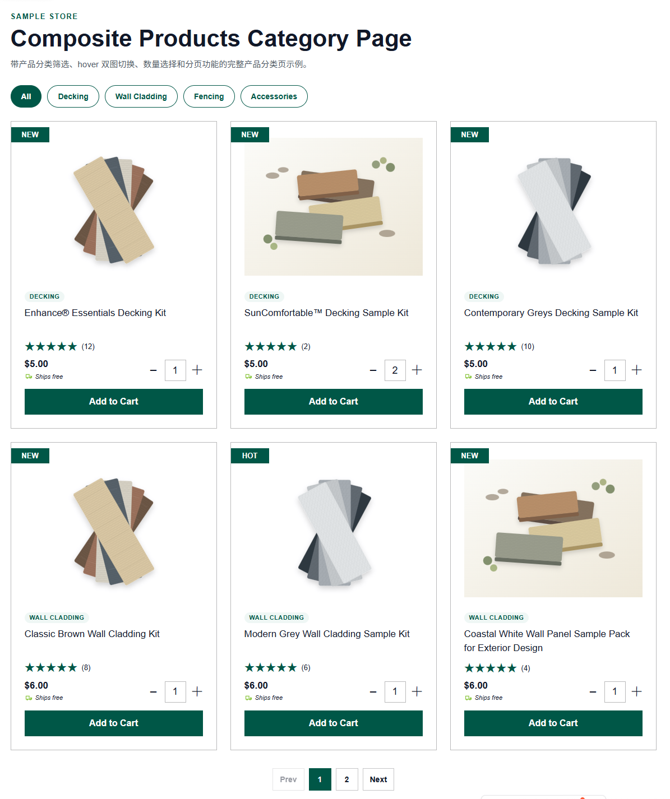
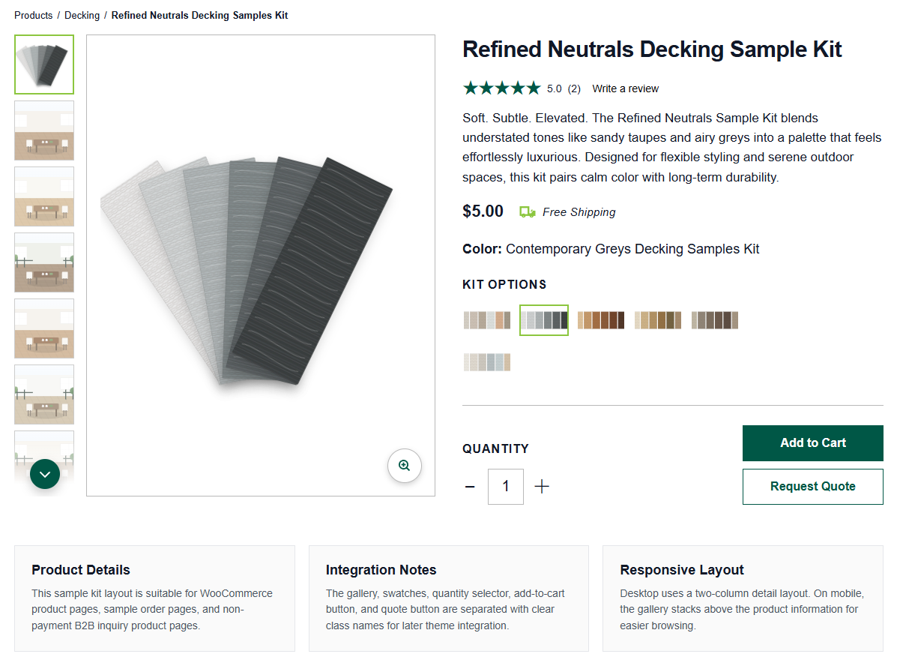

# WPC 产品列表页与产品详情页静态模板

本项目是一套面向 WPC 木塑产品展示的前端静态页面模板，主要包含两个页面：**产品分类列表页** 和 **产品详情页**。

这套页面可以作为后期搭建 WooCommerce 商城、B2B 询盘商城、产品展示型网站、样品订购页面时的前端参考模板。当前版本重点验证页面结构、视觉布局、交互逻辑和响应式效果，后期可以根据真实产品数据、商城系统字段和品牌视觉继续扩展。

---

## 效果截图

请将页面截图放到以下目录：

```text
docs/screenshots/
```

这样 README.md 可以自动显示图片：

```text
docs/screenshots/product-list-page-preview.png
docs/screenshots/product-detail-page-preview.png
```

### 产品分类列表页预览



### 产品详情页预览



---

## 页面结构

```text
wpc-product-pages-github-preview/
├── index.html
├── README.md
├── docs/
│   └── screenshots/
│       ├── .gitkeep
│       ├── product-list-page-preview.png
│       └── product-detail-page-preview.png
├── product-list/
│   ├── index.html
│   ├── README.md
│   ├── css/
│   │   └── style.css
│   ├── js/
│   │   └── script.js
│   └── assets/
│       └── svg/
└── product-detail/
    ├── index.html
    ├── README.md
    ├── css/
    │   └── style.css
    ├── js/
    │   └── script.js
    └── images/
```

---

## 入口页面说明

根目录中的 `index.html` 是一个简单的预览入口页，用于集中展示并跳转到两个核心页面：

- `product-list/index.html`：产品分类列表页
- `product-detail/index.html`：产品详情页

这个入口页的作用是方便后期预览和演示，不参与实际商城系统逻辑。后期接入 WooCommerce 或 B2B 询盘系统时，可以只提取 `product-list/` 和 `product-detail/` 中的页面结构、样式与交互逻辑。

---

## 产品分类列表页

页面路径：

```text
product-list/index.html
```

### 页面定位

产品分类列表页主要用于展示多个产品卡片，适合用于：

- Decking 样品列表
- Wall Cladding 产品列表
- Fencing 产品列表
- Accessories 配件列表
- B2B 产品展示列表
- WooCommerce 产品分类归档页参考

### 核心功能

- 页面最大宽度为 `1200px`
- 桌面端一行三列产品卡片
- 平板端自动变为两列
- 手机端自动变为单列
- 产品分类按钮筛选
- 产品分页功能
- 产品图片 hover 后切换为场景图
- 产品标题最多显示两行，超出自动隐藏
- 支持不同长度标题，保持卡片排版整齐
- 数量选择与加入购物车按钮结构完整
- CSS 与 JS 独立拆分，方便后期维护

### 适合使用的场景

这个页面适合作为产品归档页或分类页的前端原型。对于 WooCommerce 网站，可以将产品卡片结构改造成循环模板；对于普通 B2B 询盘网站，可以将 `Add to Cart` 替换为 `View Details`、`Get Quote` 或 `Send Inquiry`。

---

## 产品详情页

页面路径：

```text
product-detail/index.html
```

### 页面定位

产品详情页主要用于展示单个产品的详细信息，适合用于样品套装、地板产品、墙板产品、围栏产品、配件产品等详情展示。

### 核心功能

- 页面最大宽度为 `1200px`
- 桌面端产品图库与产品信息区域保持接近 `1:1` 的视觉比例
- 左侧为产品缩略图，右侧为主图区域
- 缩略图整体高度与主图外框高度保持一致
- 缩略图超出时隐藏，并通过上下箭头逐个切换
- 点击缩略图时，主图同步切换
- 色卡切换时，对应切换一张产品主图
- 色卡不需要绑定多张场景图，逻辑更简单，适合商城系统落地
- 放大镜按钮绝对定位在主图右下角
- 支持数量加减
- 同时包含 `Add to Cart` 和 `Request Quote` 两种按钮
- 手机端自动改为上下结构，方便浏览
- CSS 与 JS 独立拆分，便于后期集成

### 适合使用的场景

这个页面既可以用于 WooCommerce 这类支付型商城，也可以用于普通 B2B 询盘商城。

在 WooCommerce 场景中，可以保留 `Add to Cart`，并将数量选择器、价格、产品标题、评分、色卡选项接入真实产品数据。

在 B2B 询盘场景中，可以隐藏价格或购物车按钮，只保留 `Request Quote`，并将其绑定到询盘表单、邮件表单、WhatsApp、在线客服或 CRM 线索系统。

---

## 图片与素材说明

当前项目中的图片主要为 SVG 示例图，方便在没有真实产品图片的情况下测试布局和交互效果。

后期替换为真实产品图时，建议按照以下逻辑整理：

### 产品列表页图片

```text
product-list/assets/svg/
```

建议每个产品至少准备两张图：

- 产品主图：默认显示
- 场景图：鼠标 hover 时显示

这样可以形成更接近真实商城的产品卡片交互体验。

### 产品详情页图片

```text
product-detail/images/
```

建议包含以下类型图片：

- 产品主图
- 色卡图
- 产品细节图
- 场景图
- 应用案例图

当前详情页色卡逻辑为：**一个色卡对应一张产品图**。这种方式结构更简单，更适合后期对接 WooCommerce 变体图或普通产品图库。

---

## 后期扩展方向

### 1. 接入真实产品数据

后期可以将静态 HTML 中的产品标题、价格、评分、分类、图片、色卡等内容替换为真实数据。

在 WooCommerce 中，可以对应到：

- 产品标题
- 产品价格
- 产品短描述
- 产品分类
- 产品标签
- 产品特色图
- 产品图库
- 变体属性
- 库存状态

在 B2B 系统中，可以对应到：

- 产品名称
- 产品型号
- 产品颜色
- 产品应用场景
- 产品规格参数
- 下载资料
- 询盘按钮

### 2. 扩展筛选功能

当前产品列表页已经包含基础分类按钮，后期可以继续扩展为更完整的筛选系统，例如：

- 按颜色筛选
- 按系列筛选
- 按应用场景筛选
- 按材质筛选
- 按价格区间筛选
- 按库存状态筛选
- 多选筛选与组合筛选

### 3. 优化分页与加载方式

当前分页为前端静态分页，适合页面原型验证。后期可以根据系统类型扩展为：

- WooCommerce 默认分页
- Ajax 无刷新分页
- Load More 加载更多
- 无限滚动加载
- 分类切换后自动刷新产品列表

### 4. 强化产品详情页图库

当前详情页图库已经包含主图、缩略图、上下箭头和色卡切换。后期可以继续扩展：

- 图片放大预览弹窗
- 图片局部放大镜
- 视频缩略图
- 360° 产品展示
- 场景图分组
- 颜色切换后同步更新标题、价格、SKU 和描述

### 5. 适配 WooCommerce 模板

后期如果接入 WooCommerce，可以将当前结构拆分到主题模板中：

- 产品列表卡片结构：用于产品归档页循环模板
- 产品详情图库：用于单产品页图片区域
- 色卡区域：用于变体属性或自定义字段
- 数量与购物车：对接 WooCommerce 原生表单
- Request Quote：对接询盘插件或自定义表单

### 6. 适配 B2B 询盘商城

如果用于非支付型 B2B 网站，可以弱化购物车逻辑，强化询盘和转化：

- 将 `Add to Cart` 改为 `Add to Inquiry List`
- 将 `Request Quote` 绑定到询盘表单
- 增加产品规格表
- 增加下载资料区域
- 增加应用案例区域
- 增加相关产品推荐
- 增加 WhatsApp、邮箱、电话等快速联系入口

### 7. 增加 SEO 与内容模块

后期可以根据真实商城页面继续增加 SEO 相关内容：

- 分类页顶部介绍文案
- 产品详情页长描述
- FAQ 常见问题
- 应用场景说明
- 材料优势说明
- 安装说明
- 维护保养说明
- 相关博客入口

---

## 当前版本的价值

这个项目的核心价值不是最终商城系统，而是提供一套清晰的页面结构和交互原型。

它可以帮助后期开发时快速确认以下内容：

- 产品列表页应该如何排版
- 产品卡片应该包含哪些信息
- 产品图片 hover 效果是否适合当前品牌
- 产品标题多行时如何保持整齐
- 产品详情页图库如何展示
- 色卡切换逻辑如何简化
- WooCommerce 和 B2B 询盘系统如何共用同一套前端思路
- 桌面端与手机端体验是否统一

后期只需要在这个基础上替换真实图片、真实产品数据，并根据具体系统进行模板化改造，就可以逐步形成完整的商城前端页面。
